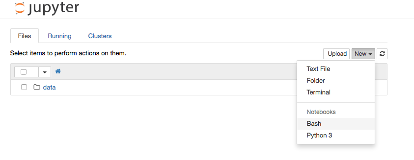

Using csvkit to process data
============================

[Csvkit](http://csvkit.rtfd.org/) is a collection of Python-based command-line tools that can help process a large amount of data really quickly. The Tutorial on the docs is pretty good, and I encourage you to go through it either before or after this lesson.

I'm going to introduce Jupyter Notebooks with this lesson, too. This will allow you to write notes with your code and to repeat the steps as needed.

## Move into or create a class directory

We need a safe place to work. I suggest setting up a class directory in your home/Documents folder.

```
$ cd ~/Documents
$ pwd
```
This puts you inside your Documents directory and prints your path to make sure you are there.

`$ mkdir rwd2016`

Move into it:

`$ cd rwd2016`


## Starting up Jupyter Notebooks

If you are not already in the *data* conda environment [we made earlier](IntroToAnaconda.md), go ahead and get in it.

`$ source activate data`

Next, we're going to install a package that will allow us to run Bash in notebook.

`$ pip install bash_kernel`

`$ python -m bash_kernel.install`

Now we are going to launch our Jupyter Notebooks server, and we'll do the rest of our work there.

`$ jupyter notebook`

This will start a Jupyter Notebooks server and throw you into a browser window. It will look something like the image below. Go under "New" and select **Bash**.



What this will also do is take over your terminal window, which is now running the Jupyter Notebooks server. If you need to do further terminal work, you'll need to open a new window (command-n) or tab (command-t).

At the top of your new notebook, click on **Untitled** and name your notebook **QuarterlyHotelData**.

Now, in another brower window, go open my [HotelsDataPipeline](https://github.com/utdata/cli-tools/blob/master/csvkit/HotelsDataPipeline.ipynb) notebook in GitHub so you can follow along.
