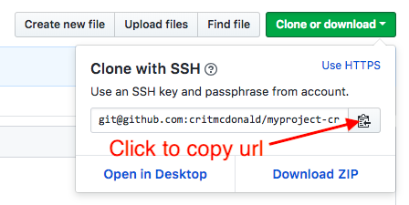

# Cloning repos, sharing code

We'll now see how you can collaborate in code with a classmate. Our goals are this:

* To pick a partner
* To clone their repo to your machine.
* To edit the README of that file.
* To add a new file.
* To commit your changes
* To push those changes to github.
* To go to your own repo and pull the changes made by your partner.
* We'll then introduce a code conflict and learn how to resolve it.

## Clone a repo

* In your browser, go to your partner's Github profile and click on Repositories, then on their repo.
* Look for the button **Clone or Download**. You want to copy the URL for cloning, like this:



A note about **Download ZIP**: This allows you to download all the code, but to NOT be "hooked up" in git to this repo. This is useful if the repo is a template for a project, and you are starting a new one. We're not doing that here, but just so you know. We'll probably do it later.

* Go into your terminal and cd into `~/Documents/code`.
* Execute `$ git clone git@github.com:critmcdonald/myproject-crit.git` but put in the URL that you have copied from your partner's repo.

This copies the repo as a folder in your `code` folder. If you wanted the repo to be a different name on your computer, you would add the name you want after the url. I tend to keep the same name unless there is a good reason not to.

* `cd` into the folder you have downloaded and then do `$ code ./`, which will open a new VS Code window with all the files in that repo. You are ready to work.

## Make your edits

* Use the explorer on the left to find your partner's `README.md` file and open it.
* Add a new sentence praising your partner's command of git and github thus far. Save and close the file.
* Add a new file to the repo called `name.md`. You can use the **File > New file** menu or the little buttons in the Explorer.
* Add a title and a paragraph of text, using proper Markdown syntax. Save and close your work. (We might talk about and load the Markdown Syntax Linter.)
* Open the Integrated Terminal and go through the steps to check status, add files, commit files (with message), and push to origin master.

## Pull your partner's edits

* Go back to the VS Code window that is your own repo.
* Use the Integrated Terminal to do `$ git pull origin master`, which will download the changes made by your partner.

## Dealing with conflicts

You might ask yourself ... what's to keep two people from changing the same line of code? Well, the can, and you will. It creates a **code conflict** that must then be resolved.

We're going to create such a conflict so you can see that this looks like.

### Your original change

* Go into your own repo and make a change within the first sentence.
* Add, commit and push your changes to Github.

So now, in your partner's repo, there is a change that you do not have in your copy, and vice versa.

### Change your partner's repo

* Go back into your partner's repo in VS Code and change that same first sentence, but do it in some different way.
* Add, commit and try to push your changes. When you try to push, you won't be able do. You'll get a message something like this:

``` bash
14:26 $ git push origin master
To github.com:critmcdonald/myproject-crit.git
 ! [rejected]        master -> master (fetch first)
error: failed to push some refs to 'git@github.com:critmcdonald/myproject-crit.git'
hint: Updates were rejected because the remote contains work that you do
hint: not have locally. This is usually caused by another repository pushing
hint: to the same ref. You may want to first integrate the remote changes
hint: (e.g., 'git pull ...') before pushing again.
hint: See the 'Note about fast-forwards' in 'git push --help' for details.
```

You can see from the hints in the error message, that there are changes on the remote repo that you don't have. Git won't let you push new changes unless you have the current remote copy from the server. That keeps you from screwing up something that is already there (which is kinda what we are doing).

So, you have to pull the remote changes first.

* Do `$ git pull origin master` to update your repo. It will work, but you'll get message about the conflict.

``` bash
14:26 $ git pull origin master
remote: Counting objects: 3, done.
remote: Compressing objects: 100% (2/2), done.
remote: Total 3 (delta 1), reused 0 (delta 0), pack-reused 0
Unpacking objects: 100% (3/3), done.
From github.com:critmcdonald/myproject-crit
 * branch            master     -> FETCH_HEAD
   4da6b8c..a6eede8  master     -> origin/master
Auto-merging README.md
CONFLICT (content): Merge conflict in README.md
Automatic merge failed; fix conflicts and then commit the result.
```

Now look at the file, and it will look pretty crazy. Here is mine:


Let's break this down:

* The highlighted line with `HEAD` is the beginning of the conflict.
* The other highlighted line is the end of the conflict.
* It's up to you to choose what should be inbetween those notes. You would of course want to discuss this with your collaborator and come to an agreement on what this should be. Fix up the file the way you have agreed and then remove all the notes and the line between the two pieces.
* Once you have it the way you like it, save, add, commit and push.

### Get your own repo right

* Got back to your own repo in VS Code and do `git pull origin master`. Depending on how you resolved the conflict together, you might have to go through the process again. You might go look at the repo on Github and copy/paste the line to ensure you have it the same. Add, commit and push as necessary.

## Good coding practices: Syntax

One tactic to being a good collaborator with code is to follow syntax, meaning you write code to a shared standard. Each programming language has its own standard, including how many spaces to indent, how you capitialize, etc.

We've been writing in Markdown, and here are two resources about that syntax:

* [Markdown tutorial](https://guides.github.com/features/mastering-markdown/)
* [Markdown syntax](https://help.github.com/articles/basic-writing-and-formatting-syntax/)

------

Next: [Git branches](git-branch.md)