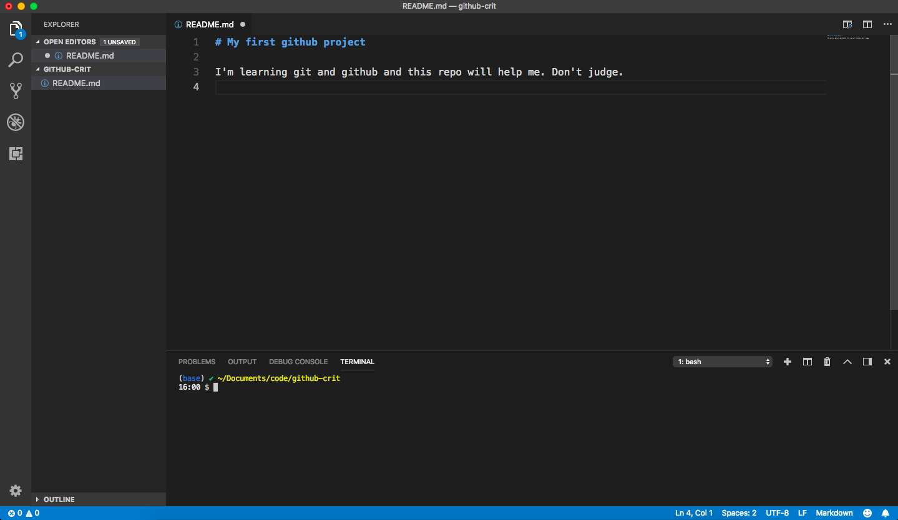

# Git version control

Make sure you've [installed VS Code, Git, have configured it and have a Bitbucket account with SSH keys](https://bitbucket.org/utdata/setting-up/src/master/) before continuing here.

## Defining verison control

[Search on google](https://www.google.com/search?q=understanding+git+version+control&oq=understanding+git+version+control) and you'll find a ton of [posts](https://www.atlassian.com/git/tutorials/what-is-version-control), [tutorials](https://www.codecademy.com/learn/learn-git) and [videos](https://www.youtube.com/watch?v=Y9XZQO1n_7c) about Git and version control systems. I encourage you to explore some that fit you learning style. We'll just cover enough here to get you going and we'll learn by doing.

At its most basic, Git allows you to save your work at intervals and it keeps a history of every save point on your computer. Once you have something that works, you save it and leave a comment about what you've done. You can then go back to that exact point in time if you need to. This frees the coder to experiment and make changes that may NOT work, because you know you can always go back. It works for any kind of file you want to put under verison control.

Git allows for a "distributed" version control system, meaning that other people can share the entire code base. When they "check out" a repository (or repo), they get the entire code base. Contributors can then make changes and "check in" those changes for others to use.

[Bitbucket Cloud](https://bitbucket.org/) is the central server where we will save our code. It's also a project management tool and a social network of sorts. It's used by a lot of large companies because there are suite of other products that work with that help programmers. Most importantly, they offer free accounts for university students. [Github](https://github.com/) is another popular code sharing service.

## Our goals

A repository -- or "repo" -- is a folder on your computer that is tracked by git. Our goals here are the following:

* Create a repo on Bitbucket.
* Clone it to our own machine.
* Edit files and use the git cycle to save and push them to Bitbucket.

## Create a repo in Bitbucket

Since we starting a new project that we know we want to track in Bitbucket, we'll start there. Know it is possible to connect and existing repo on your computer to a Bitbucket repo if needed.

* Log into Bitbucket and click on the big + sign on the left navigation, then choose **Repository**.
* For the repository name, call it "myproject-firstname".
* Uncheck the private box so it is public.
* For the README, choose **Yes, with a tutorial (for beginners)**.
* Keep the version control as **Git**.

This will take you to the home page for your repository. It lists the files in the repository and shows the README file that Bitbucket created.

That README is written in a language called [Markdown](https://guides.github.com/pdfs/markdown-cheatsheet-online.pdf), which is a text-based syntax that Bitbucket turns into pretty HTML when it is published, but is completely readable as text. Here is a [cheatsheet of the syntax](https://commonmark.org/help/) and [10-minute tutorial](https://commonmark.org/help/tutorial/) you may find useful.

## Create our working space

There are many ways to create folders on your computer. We're going to use the Terminal and the Code app so we can get used to using them.

* Open your Terminal and type in `$ cd ~/Documents/`
* Create your two directories, but use your name. Always use lowercase letters and no spaces in file and folder names. You'll thank me later:

```bash
mkdir code
```

* Move into your folder:

```bash
cd code
```

## Cloning your repo from Bitbucket

Now, go back to your browser to the project you created.

* Click on the **Clone** button at the top right.
* The pop-up window shows the command you need to clone your repository to your computer. Click on the copy button to the right of it.
* Go back to your Terminal and paste in that text and hit return to run the code.

It should look something like this::

```bash
$ git clone git@bitbucket.org:christianmcdonald/myproject-christian.git
Cloning into 'myproject-christian'...
remote: Counting objects: 3, done.
remote: Compressing objects: 100% (2/2), done.
remote: Total 3 (delta 0), reused 0 (delta 0)
Receiving objects: 100% (3/3), done.
```

So, `git clone` is the command and what follows is the path to your project.

Next, we need to move into the folder.

```bash
cd myproject-christian
```

We're going to start using our code editor now to manage both our files and our Terminal. If you've configured your text editor right, we should be able to open VS Code inside our repo.

```bash
code ./
```

Hollar if that doesn't work. [This may help if it doesn't](https://code.visualstudio.com/docs/setup/mac).

Let's talk about that command. `code` is the command to invoke the VS Code editor. We followed that `./` which means the current folder.

You should see the README file on the left pane. Go ahead and click on it and it will open in the editor.

You may have noticed `README.md` breaks our rule about lowercase file names. Uppercasing README is a convention. Just the way it is.

### The Integrated Terminal

A cool thing about VS Code is you can open a Terminal window inside the editor and do shell commands there. You can find this under **View > Integrated Terminal**, or use **Control-`** on a Mac. This should open a terminal at the root of the project you have open. It will look something like this:



### Adding a new file

We're going to use that Integrated Terminal to create a new file.

* Go into the Integrated Terminal and use the `touch` command to create a new file, **using your name** for the file name. It will be a Markdown file:

```bash
touch myname.md
```

* You'll notice the file show up in the list of files in the File Explorer on the left. Click on that and it will open the file in the editor.
* Add a headline and some text to the file, like thi below:

``` markdown
# My first Bitbucket project

I'm learning git and Bitbucket and this repo will help me. Don't judge.
```

You can save the file, but keep it open.

### The git cycle

There typically three steps to committing code in git:

* `git add` to stage files that have changed.
* `git commit` to commit (or save) the files. We'll add a comment at the same time.
* `git push` to publish the changes to Bitbucket.

There is a fourth git command I use a lot, and that is `git status`, which tells you what state each file is in the cycle.

You'll repeat these steps a lot.

Let's check the status of our repo.

* Go into the Integrated Terminal, and type in the `git status`. Here is my command and response:

``` bash
$ git status
On branch master
Your branch is up-to-date with 'origin/master'.
Untracked files:
  (use "git add <file>..." to include in what will be committed)

        christian.md

nothing added to commit but untracked files present (use "git add" to track)
(base) ✔ ~/Documents/code/myproject-christian [master|…1]
```

We have one untracked file, `myname.md`, and Git has been nice enough to tell you how to stage your file. Let's add it with `git add myname.md`. Here is the command and response:

``` bash
$ git add christian.md
(base) ✔ ~/Documents/code/myproject-christian [master|●1]
```

There wasn't really a response, but because I have the git-bash-prompt extension installed (which you should have installed in [setting-up](https://bitbucket.org/utdata/setting-up/src/master/)), I have some feedback. We haven't talked about that yet, but that part `[master L|●1]` tells me we are on the `master` branch (more on that later) and that I have one staged file. Just watch how those signals change as we go through the cycle.

Now let's commit the file. We will also add a "message" to the commit using the flag `-m`, which you should ALWAYS do. It's good coding practice. Here is the call and response:

``` bash
$ git commit -m "adding my new file"
[master da864f5] adding my new file
 1 file changed, 3 insertions(+)
 create mode 100644 christian.md
(base) ✔ ~/Documents/code/myproject-christian [master ↑·1|✔]
```

Congrats! You have made your first commit, saving this point in time on your computer. Our next step is to push that to Bitbucket.

* Use the `git push` command to push this to Bitbucket. Part of the `push` command is to say exactly where to send these change. Do this, then I'll explain it:

```bash
$ git push origin master
Counting objects: 3, done.
Delta compression using up to 4 threads.
Compressing objects: 100% (3/3), done.
Writing objects: 100% (3/3), 372 bytes | 0 bytes/s, done.
Total 3 (delta 0), reused 0 (delta 0)
To bitbucket.org:christianmcdonald/myproject-christian.git
   07ef72b..da864f5  master -> master
(base) ✔ ~/Documents/code/myproject-christian [master|✔]
```

That's a lot of mumbo jumbo that we don't have to understand details of, we just have to recognize that it did "Writing" and you didn't get an error.

Why `origin master`? This is the part that sends this to our Bitbucket repo to share with the world. The `master` part is the branch name, and that is something we'll get into in a future lesson.

* Now go back to your browser and hit refresh on your repo, and you'll see the result there. Woo hoo!

## Repeat: Add, commit, push

Now let's make another change to your file and repeat the cycle.

* Go into VS Code and add a new sentence to your `myname.md` file.
* Use the terminal to check the status of your repo using `git status`.

```bash
$ git status
On branch master
Your branch is up-to-date with 'origin/master'.
Changes not staged for commit:
  (use "git add <file>..." to update what will be committed)
  (use "git checkout -- <file>..." to discard changes in working directory)

        modified:   christian.md

no changes added to commit (use "git add" and/or "git commit -a")
(base) ✔ ~/Documents/code/myproject-christian [master|✚ 1]
```

* The return says we have one modified file. Since it is the only modified file and we want to stage it, we'll use a fancy command to add "all" the modified files so we don't have to name it. The period means "all changed files".

```bash
$ git add .
(base) ✔ ~/Documents/code/myproject-christian [master|●1]
```

There isn't really a response for staging a file if it is successful.

* Now finish it out by committing the changes:

```bash
$ git commit -m "adding changes"
[master 22acae0] adding changes
 1 file changed, 2 insertions(+)
(base) ✔ ~/Documents/code/myproject-christian [master ↑·1|✔]
```

* And then push them to master:

```bash
$ git push origin master
Counting objects: 3, done.
Delta compression using up to 4 threads.
Compressing objects: 100% (3/3), done.
Writing objects: 100% (3/3), 336 bytes | 0 bytes/s, done.
Total 3 (delta 1), reused 0 (delta 0)
To bitbucket.org:christianmcdonald/myproject-christian.git
   da864f5..22acae0  master -> master
(base) ✔ ~/Documents/code/myproject-christian [master|✔]
```

Well done! You've learned the basic git cycle and pushed code to Bitbucket so others can work on it. That's next.

----

Next: [Working with others](git-clone.md)
